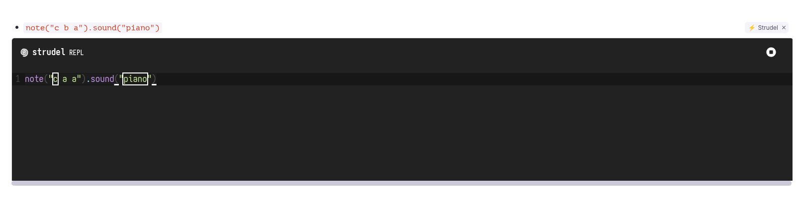

# Strudel.cc in RemNote: Add Strudel to your rems

I have put this plugin together (vibe coded it) because I'm learning _musical harmony_ and so far, it works! use `/strudel: Embed REPL` to embed a Strudel REPL.

Whatever Strudel code you put in your rem, it will reflect on your embedded REPL. If you change what you have on your rem, the plugin will ask you to reload the REPL so that it can reflect the changes. You can still edit inside the REPL but anything not put in writing on your rem will be gone next time you visit your document. If Strudel offers an API to update the REPL from outside the `iframe`, I would like to know about it!
